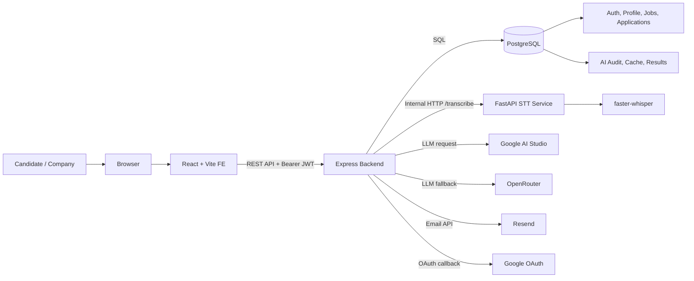
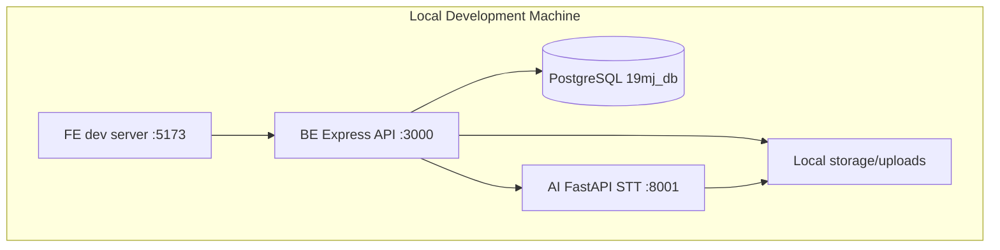
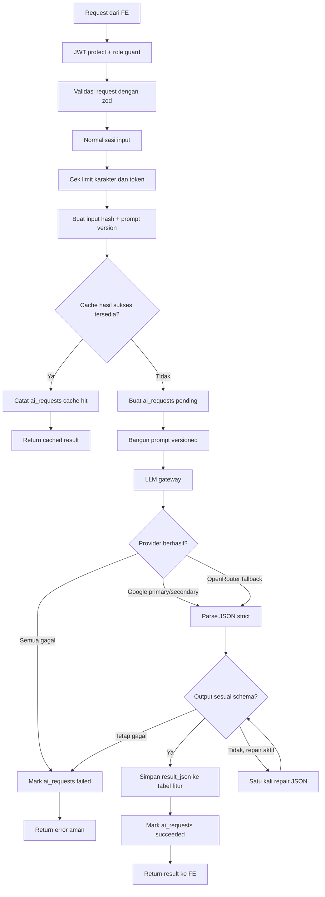
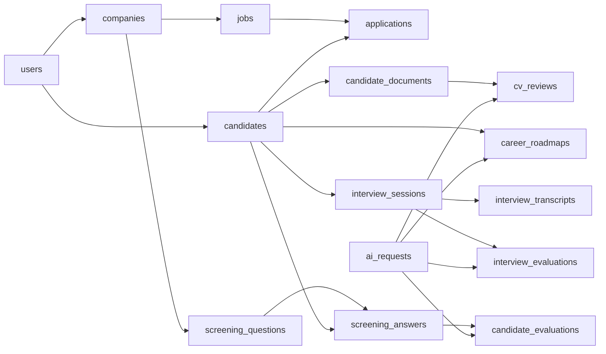
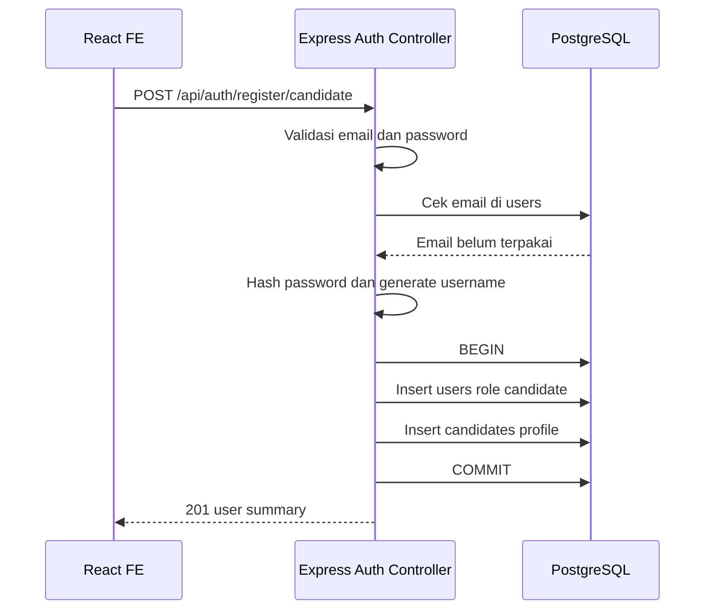
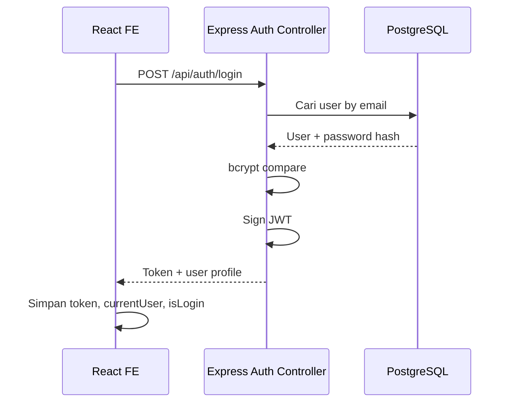
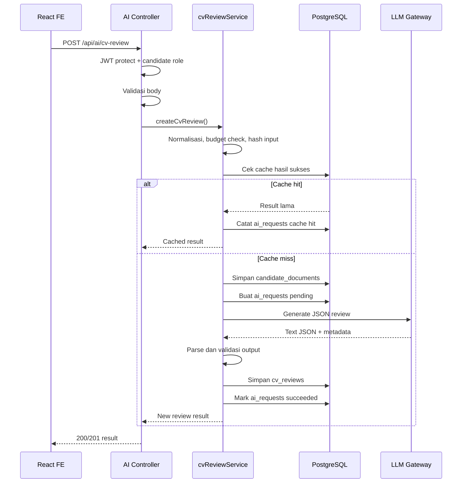
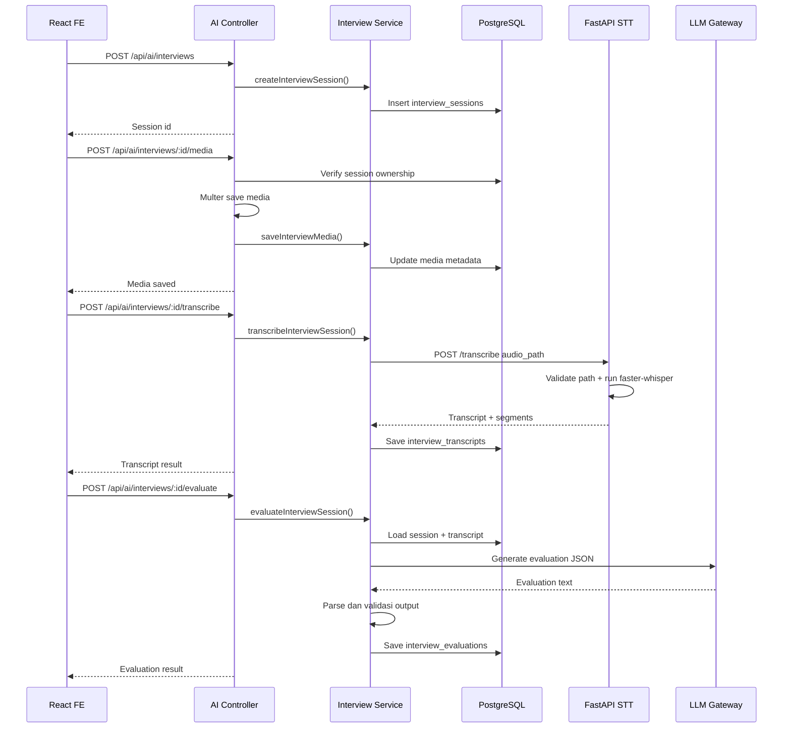
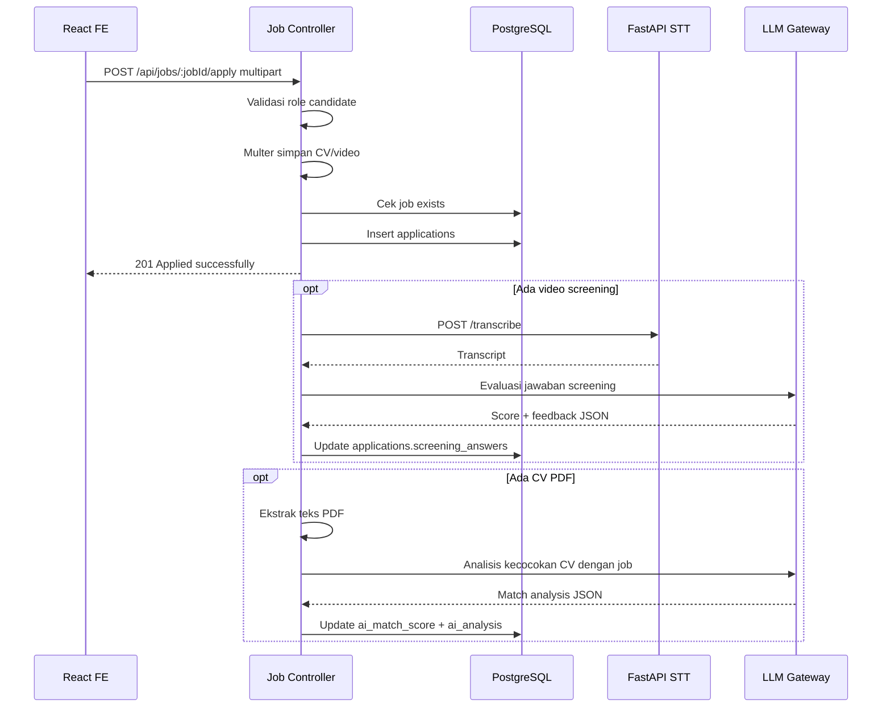

# 19MJ Project Learning Guide

Dokumen ini menjelaskan project 19MJ dari sisi produk, arsitektur, teknologi, alur data, database, API, AI, dan alasan desainnya. Target pembaca adalah orang yang sudah memahami konsep teknologi dasar, tetapi belum mengenal detail project ini.

## 1. Ringkasan Project

19MJ adalah platform AI Career Development & Hiring. Sistem ini mempertemukan dua jenis pengguna:

- Candidate: pengguna pencari kerja yang bisa membuat profil, mencari lowongan, melamar pekerjaan, meminta review CV, membuat career roadmap, dan latihan interview.
- Company: perusahaan yang bisa membuat lowongan, melihat pelamar, mengelola recruitment, membuat screening, dan meminta bantuan AI untuk mengevaluasi kandidat.

Secara teknis, project ini berbentuk monorepo dengan tiga bagian utama:

```text
19MJ/
  FE/  Frontend React untuk candidate dan company.
  BE/  Backend Express sebagai API utama, auth, database, dan orchestration AI.
  AI/  Service Python FastAPI untuk speech-to-text lokal.
```

Backend adalah pusat sistem. Frontend tidak memanggil provider AI langsung. Frontend hanya memanggil backend, lalu backend memutuskan apakah perlu membaca database, memanggil LLM provider, atau memanggil service STT lokal.

## 2. Masalah Yang Diselesaikan

Project ini mencoba menyelesaikan dua sisi proses hiring:

- Candidate sering kesulitan memahami kualitas CV, skill gap, kesiapan interview, dan langkah belajar menuju role tertentu.
- Company membutuhkan cara lebih cepat untuk mengelola lowongan, membaca aplikasi, screening awal, dan mengevaluasi kecocokan kandidat.

Karena itu fitur project dibagi menjadi fitur career development dan fitur hiring:

- Career development: CV review, career roadmap, interview practice, profile management.
- Hiring: job posting, job application, recruitment dashboard, candidate recommendation, screening question, AI evaluation.

## 3. Arsitektur Tingkat Tinggi

Alur umum sistem:

```text
Browser
  |
  | HTTP request
  v
React FE
  |
  | REST API + Bearer JWT
  v
Express BE
  |             \
  | SQL          \ Internal HTTP
  v              v
PostgreSQL     FastAPI AI STT
  |
  | audit/cache/result
  v
AI feature tables

Express BE juga memanggil:
  - Google AI Studio / Gemini untuk LLM utama.
  - OpenRouter untuk fallback LLM.
  - Resend untuk email reset password.
  - Google OAuth untuk login Google.
```

Diagram komponen:



Diagram deployment lokal:



Alasan bentuk ini cocok:

- Frontend tetap sederhana dan tidak menyimpan secret provider.
- Backend menjadi satu tempat untuk auth, validasi, role guard, business rule, dan audit.
- STT dipisah ke Python karena ekosistem machine learning dan library audio lebih matang di Python.
- PostgreSQL menyimpan data relasional, JSON hasil AI, audit request, dan cache dengan konsisten.

## 4. Tech Stack Dan Alasannya

### React + Vite di Frontend

Frontend memakai React, Vite, React Router, Framer Motion, Axios/fetch wrapper, dan beberapa library pembantu untuk OAuth, PDF, DOCX, icon, dan font.

Alasan cocok:

- React cocok untuk dashboard interaktif karena UI dibangun dari komponen yang dapat dipakai ulang.
- Vite cocok untuk development cepat karena startup dan hot reload ringan.
- React Router cocok karena aplikasi memiliki banyak halaman role-based seperti `/dashboard`, `/cv-review`, `/company/job-postings`, dan `/company/recruitment`.
- Framer Motion dipakai untuk transisi halaman agar pengalaman UI lebih halus tanpa mengubah arsitektur data.
- PDF/DOCX library di frontend mendukung fitur candidate seperti input CV atau dokumen.

### Node.js + Express di Backend

Backend memakai Node.js, Express, `pg`, JWT, bcrypt, Passport Google OAuth, multer, zod, Swagger, dan adapter provider AI.

Alasan cocok:

- Express sederhana dan cukup untuk REST API project capstone tanpa framework berat.
- Node.js cocok karena frontend juga JavaScript, sehingga tim bisa berbagi pola pikir dan struktur data.
- `pg` memberi akses langsung ke PostgreSQL tanpa ORM. Ini cocok untuk project yang butuh kontrol query dan belum memerlukan abstraction layer besar.
- JWT cocok untuk API stateless antara frontend dan backend.
- bcrypt cocok untuk hashing password karena memang dibuat untuk password hashing.
- zod cocok untuk validasi request/output AI karena schema eksplisit dan error mudah dikembalikan ke client.
- multer cocok untuk upload CV, video, dan media interview.

### PostgreSQL

Database utama adalah PostgreSQL. Data inti seperti user, candidate, company, job, application, reset password, AI request, CV review, roadmap, transcript, evaluation, screening question, dan screening answer disimpan di PostgreSQL.

Alasan cocok:

- Data project bersifat relasional: user punya role, candidate/company punya profile, company punya jobs, job punya applications, dan application punya candidate.
- PostgreSQL mendukung constraint, foreign key, transaction, index, dan trigger `updated_at`, sehingga integritas data bisa dijaga di level database.
- PostgreSQL mendukung JSONB. Ini cocok untuk data semi-terstruktur seperti `skills`, `screening_answers`, `metadata_json`, `segments_json`, dan `result_json` hasil AI.
- Kombinasi tabel relasional dan JSONB membuat project tidak perlu memakai database kedua hanya untuk hasil AI.

### FastAPI + faster-whisper di Service AI

Folder `AI/` adalah service internal untuk speech-to-text. Service ini memakai FastAPI, Pydantic, dan faster-whisper. Ada dukungan fallback engine lama `whisper.cpp`, tetapi default saat ini adalah `faster-whisper`.

Alasan cocok:

- Python adalah ekosistem paling praktis untuk inference model audio.
- FastAPI ringan dan otomatis memberi kontrak request/response berbasis Pydantic.
- faster-whisper cocok untuk STT lokal karena performanya lebih baik dan bisa memakai CUDA jika tersedia.
- Service dipisahkan dari backend agar dependency ML tidak membebani runtime Node.js.

### Google AI Studio Dan OpenRouter

Backend memiliki LLM gateway yang mencoba provider secara berurutan:

1. Google provider dengan model primary.
2. Google provider dengan model secondary.
3. OpenRouter fallback.
4. OpenRouter fallback kedua.

Alasan cocok:

- Provider AI bisa gagal karena rate limit, network, quota, atau model issue.
- Gateway fallback membuat fitur AI lebih tahan terhadap gangguan satu provider.
- Provider-specific code ditempatkan di adapter sehingga service fitur tidak perlu tahu detail API Google atau OpenRouter.
- Output AI divalidasi sebelum disimpan, sehingga hasil yang masuk database lebih terkontrol.

Catatan: README root menyebut ChromaDB, tetapi dependency dan kode yang terlihat saat ini belum menunjukkan integrasi ChromaDB aktif. Sistem AI yang aktif sekarang memakai PostgreSQL untuk audit/cache/result dan LLM provider untuk generasi teks.

## 5. Struktur Folder

### Root

```text
README.md        Ringkasan project, tim, timeline, dan stack.
learn.md         Dokumen pembelajaran project ini.
FE/              Aplikasi frontend.
BE/              Backend API.
AI/              Service STT lokal.
```

### Folder FE

```text
FE/
  src/
    App.jsx                    Definisi route utama dan private route.
    main.jsx                   Entry point React.
    utils/api.js               Wrapper API dengan Bearer token.
    pages/                     Halaman auth, register, reset password, callback OAuth.
    dashboard/                 Halaman candidate.
    dashboard2/                Halaman company.
    components/                Komponen umum.
    App.css, index.css         Style global.
    responsive.css             Style responsive.
  public/                      Asset publik.
  package.json                 Dependency dan script frontend.
  vite.config.js               Konfigurasi Vite.
```

### Folder BE

```text
BE/
  src/
    index.js                   Entry point Express.
    config/                    Database, Passport Google OAuth, Resend, env helper.
    routes/                    Route auth dan job.
    controllers/               Controller auth dan job.
    middleware/                JWT auth dan rate limit.
    utils/                     Helper PIN reset password dan email template.
    ai/
      routes/                  Route /api/ai.
      controllers/             Controller AI.
      services/                Orkestrasi business flow AI.
      repositories/            Query PostgreSQL fitur AI.
      llm/                     Adapter Google, OpenRouter, error mapping, gateway.
      prompts/                 Prompt per fitur AI.
      validators/              Validasi request dan output AI.
      middleware/              Upload media interview.
      storage/                 Helper path storage media.
      utils/                   Hash, JSON parser, logger, normalizer.
      docs/                    Swagger endpoint AI.
  scripts/                     Script migrasi dan smoke test.
  schema.sql                   Skema database utama.
  package.json                 Dependency dan script backend.
```

### Folder AI

```text
AI/
  app.py                       Entry point FastAPI.
  services/transcription_service.py
                               Logic validasi path, load model, dan transkripsi.
  models/model_loader.py       Konfigurasi STT dari env.
  scripts/                     Script download model dan tool STT.
  requirements.txt             Dependency Python.
```

## 6. Frontend

Frontend memakai route role-based di `FE/src/App.jsx`.

Route utama candidate:

- `/dashboard`
- `/my-profile`
- `/cv-review`
- `/career-planner`
- `/interview-practice`
- `/find-jobs`
- `/my-applications`

Route utama company:

- `/company/dashboard`
- `/company/profile`
- `/company/job-postings`
- `/company/job-postings/create`
- `/company/recruitment`
- `/company/recommendations`

Route auth dan recovery:

- `/login`
- `/register`
- `/company/login`
- `/company/register`
- `/forgot-password`
- `/verify-reset-pin`
- `/reset-password`
- `/auth/callback`

`PrivateRoute` membaca `localStorage.isLogin` dan `localStorage.currentUser`. Jika user belum login, user diarahkan ke `/login`. Jika role tidak sesuai, user diarahkan ke dashboard sesuai role.

`FE/src/utils/api.js` adalah wrapper untuk request backend. File ini:

- mengambil token dari `localStorage.token`;
- menambahkan header `Authorization: Bearer <token>`;
- mengirim JSON untuk request biasa;
- membiarkan browser membuat boundary saat body berupa `FormData`;
- melempar error jika response backend tidak `ok`.

Alasan desain frontend:

- Route role-based menjaga candidate dan company tidak masuk dashboard yang salah.
- Token disimpan di satu pola yang mudah dipakai oleh semua halaman.
- API wrapper mengurangi duplikasi header dan error handling.

Risiko yang perlu dipahami:

- `localStorage` mudah dipakai, tetapi rentan jika ada XSS. Karena itu frontend tidak boleh memasukkan HTML mentah tidak terpercaya.
- Proteksi frontend hanya untuk UX. Proteksi asli tetap harus ada di backend lewat JWT dan role guard.

## 7. Backend Express

Entry point backend ada di `BE/src/index.js`.

Backend melakukan:

- load `.env`;
- membuat Express app;
- mengaktifkan CORS dari `CORS_ORIGINS` atau `FE_URL`;
- menerima JSON dan URL encoded body sampai 50 MB;
- menginisialisasi Passport;
- menyajikan file upload dari `/uploads`;
- memasang route `/api/auth`, `/api/jobs`, dan `/api/ai`;
- memasang Swagger AI jika aktif;
- menyajikan build frontend dari `FE/dist` untuk route non-API;
- memberi 404 JSON untuk route `/api` yang tidak ditemukan.

Route backend utama:

```text
/api/auth  Auth, profile, Google OAuth, forgot password.
/api/jobs  Job posting, apply job, applications, recruitment.
/api/ai    CV review, career roadmap, interview, screening AI.
/api/health
```

Alasan backend menjadi pusat:

- Secret seperti database password, JWT secret, Google AI key, OpenRouter key, Resend key, dan Google OAuth secret tidak boleh ada di frontend.
- Semua role dan ownership check harus konsisten.
- Semua output AI perlu divalidasi sebelum masuk database.

## 8. Auth Dan User Management

Auth mendukung:

- register candidate;
- register company;
- login email/password;
- login Google OAuth;
- endpoint `/me`;
- update profile;
- public profile;
- reset password berbasis PIN.

Password disimpan memakai bcrypt. Login menghasilkan JWT berisi:

```json
{
  "id": 1,
  "email": "user@example.com",
  "role": "candidate"
}
```

Middleware `protect` memvalidasi header:

```text
Authorization: Bearer <jwt>
```

Middleware `requireRole` membatasi endpoint berdasarkan role, misalnya candidate-only atau company-only.

Reset password memakai tabel `password_reset_requests`. PIN di-hash, punya expiry, attempt limit, cooldown resend, dan status konsumsi. Endpoint request reset password mengembalikan pesan publik yang seragam agar penyerang tidak bisa menebak apakah email terdaftar.

Alasan desain auth:

- JWT membuat API stateless dan mudah dipakai oleh SPA.
- Role di token membuat guard cepat, tetapi data penting tetap sebaiknya dicek ke database saat butuh ownership.
- Reset PIN dengan hash lebih aman daripada menyimpan PIN mentah.
- Response seragam pada forgot password mengurangi risiko email enumeration.

## 9. Job Dan Recruitment

Fitur job berada di `BE/src/routes/jobRoutes.js` dan `BE/src/controllers/jobController.js`.

Fitur company:

- membuat job;
- melihat job milik company;
- melihat aplikasi terbaru;
- melihat pelamar per job;
- mengubah status aplikasi;
- scouting kandidat;
- update job;
- close job.

Fitur candidate:

- melihat lowongan terbuka;
- melamar job;
- mengupload CV;
- mengirim jawaban screening;
- mengupload video screening;
- melihat aplikasi sendiri.

Saat candidate apply:

1. Backend memvalidasi role candidate.
2. Backend menerima file lewat multer.
3. Backend menyimpan metadata aplikasi ke `applications`.
4. Jika ada video, backend menjalankan background process untuk STT dan evaluasi jawaban.
5. Jika ada CV PDF, backend mengekstrak teks dan meminta LLM membuat match analysis.
6. Hasil AI disimpan kembali ke `applications`.

Alasan desain job:

- Job dan application adalah data relasional kuat, sehingga cocok disimpan sebagai tabel.
- Upload file diproses backend agar frontend tidak memegang akses storage.
- Proses CV/video dilakukan background agar response apply tidak harus menunggu semua AI selesai.

## 10. Modul AI Backend

Modul AI backend berada di `BE/src/ai`.

Pembagian layer:

- Route: mendefinisikan endpoint dan middleware role.
- Controller: membaca request, validasi awal, memanggil service, membentuk response.
- Service: business flow dan orchestration AI.
- Repository: query PostgreSQL.
- LLM adapter: provider-specific request/response.
- Validator: validasi request publik dan struktur output AI.
- Prompt: template prompt dan versi prompt.
- Utility: hash, parse JSON, logging aman, normalisasi teks.

Fitur AI utama:

- CV Review.
- Career Roadmap.
- Interview Session.
- Interview Transcription.
- Interview Evaluation.
- Screening Question.
- Screening Answer.
- Candidate Evaluation.

Alur umum fitur AI:

```text
Request FE
  |
  v
AI route protected
  |
  v
Controller validasi body
  |
  v
Service normalisasi input
  |
  v
Budget check
  |
  v
Hash input + prompt version
  |
  v
Cek cache hasil sukses
  |
  | cache hit
  v
Return cached result

Jika cache miss:
  |
  v
Buat ai_requests pending
  |
  v
Panggil LLM gateway
  |
  v
Parse JSON strict
  |
  v
Validasi schema output
  |
  v
Simpan result table
  |
  v
Mark ai_requests succeeded
```

Diagram pipeline AI:



Jika provider gagal:

```text
LLM error
  |
  v
Gateway coba provider berikutnya jika error retryable
  |
  v
Jika semua gagal, ai_requests ditandai failed
  |
  v
Client menerima error aman
```

Alasan desain AI:

- Output AI tidak dipercaya mentah. Sistem memaksa JSON valid dan schema yang jelas.
- `ai_requests` menjadi audit trail untuk status, provider, model, latency, cache hit, error category, dan metadata aman.
- Hash input + versi prompt membuat cache deterministik. Jika prompt berubah, cache lama tidak dipakai untuk prompt baru.
- Service layer membuat controller tetap tipis dan mudah diuji.

## 11. LLM Gateway

`BE/src/ai/llm/llmGateway.js` membuat rencana provider dari env:

```text
google primary
google secondary
openrouter fallback
openrouter secondary fallback
```

Provider Google ada di `googleProvider.js`. Provider OpenRouter ada di `openRouterProvider.js`.

Setiap provider mengembalikan bentuk umum:

```json
{
  "text": "hasil teks",
  "provider": "google",
  "model": "nama-model",
  "latencyMs": 1234
}
```

Alasan desain gateway:

- Service fitur tidak perlu tahu detail API provider.
- Fallback provider menjaga fitur tetap berjalan saat satu provider bermasalah.
- Error provider dipetakan ke kategori seperti auth, quota, invalid response, network, atau all failed.
- Metadata attempt disimpan tanpa log prompt atau data user mentah.

## 12. Validasi Output AI

Output AI diproses oleh `aiOutputService.js`.

Tahapnya:

1. Parse strict JSON.
2. Tolak markdown code fence yang membungkus JSON.
3. Validasi schema berdasarkan feature.
4. Jika diperbolehkan, lakukan satu kali repair prompt untuk mengubah output menjadi JSON valid.
5. Jika tetap gagal, endpoint mengembalikan error aman.

Schema hasil AI ada di `aiResultValidators.js`.

Contoh struktur yang divalidasi:

- `cv_review`: overallScore, summary, strengths, weaknesses, improvementSuggestions, keywordGaps, recommendedRoles.
- `career_roadmap`: targetRole, readinessScore, summary, skillGaps, phases.
- `interview_evaluation`: overallScore, communicationScore, relevanceScore, structureScore, summary, strengths, improvements.
- `candidate_evaluation`: fitScore, recommendation, summary, strengths, risks, interviewFocusAreas.

Alasan:

- LLM bisa memberi output yang terlihat benar tetapi formatnya salah.
- Database hanya boleh menyimpan hasil yang sudah valid.
- Frontend lebih mudah render data jika shape-nya stabil.

## 13. Service STT Python

Service STT berada di `AI/app.py`.

Endpoint:

```text
GET  /health
POST /transcribe
```

Request `/transcribe` menerima:

```json
{
  "audio_path": "/path/audio.mp3",
  "language": "auto",
  "context_prompt": "optional",
  "hotwords": "optional"
}
```

Response sukses:

```json
{
  "status": "completed",
  "transcript": "hasil transkripsi",
  "segments": [],
  "latency_ms": 1234,
  "model": {}
}
```

Keamanan path:

- Service memvalidasi file benar-benar ada.
- Path harus file, bukan folder.
- Path harus berada di bawah `AI_ALLOWED_AUDIO_ROOT`.
- Jika `AI_SERVICE_TOKEN` diisi, request backend harus mengirim header `X-19MJ-AI-Token`.

Alasan STT dipisahkan:

- Node.js tidak ideal untuk menjalankan inference STT lokal.
- Python memudahkan akses faster-whisper, CUDA, Pydantic, dan tooling model.
- Backend tetap fokus pada API dan business logic.

## 14. Database

Skema utama ada di `BE/schema.sql`. Ada juga script migrasi tambahan untuk profile dan screening.

Tabel inti:

```text
users
candidates
companies
jobs
applications
password_reset_requests
```

Tabel AI:

```text
ai_requests
candidate_documents
cv_reviews
career_roadmaps
interview_sessions
interview_transcripts
interview_evaluations
screening_questions
screening_answers
candidate_evaluations
```

Relasi penting:

- `users` adalah tabel auth utama.
- `candidates.user_id` mengarah ke `users.id`.
- `companies.user_id` mengarah ke `users.id`.
- `jobs.company_id` mengarah ke user company.
- `applications.job_id` mengarah ke `jobs.id`.
- `applications.candidate_id` mengarah ke user candidate.
- Tabel AI menyimpan `user_id`, `company_user_id`, `candidate_user_id`, atau `ai_request_id` sesuai kepemilikan data.

ERD ringkas berdasarkan schema dan migrasi yang terlihat:

```mermaid
erDiagram
  USERS {
    int id PK
    varchar email UK
    varchar password
    varchar role
    timestamp created_at
    timestamp updated_at
  }

  CANDIDATES {
    int id PK
    int user_id FK
    varchar username UK
    varchar full_name
    varchar headline
    text summary
    text about
    text photo
    jsonb experiences
    jsonb education_list
    jsonb skills
    varchar location
  }

  COMPANIES {
    int id PK
    int user_id FK
    varchar company_name
    varchar industry
    varchar website
    text description
    varchar location
    varchar employee_count
    text logo
  }

  JOBS {
    int id PK
    int company_id FK
    varchar title
    varchar location
    varchar type
    varchar experience_level
    varchar salary_range
    text description
    text requirements
    jsonb skills
    jsonb screening_questions
    varchar status
  }

  APPLICATIONS {
    int id PK
    int job_id FK
    int candidate_id FK
    varchar status
    int ai_match_score
    text ai_analysis
    jsonb screening_answers
    text video_answer_url
    text cv_url
  }

  PASSWORD_RESET_REQUESTS {
    int id PK
    int user_id FK
    varchar email_snapshot
    varchar pin_hash
    timestamp expires_at
    int attempt_count
    timestamp verified_at
    timestamp consumed_at
  }

  AI_REQUESTS {
    int id PK
    int user_id FK
    varchar feature
    varchar prompt_version
    varchar provider
    varchar model
    varchar status
    varchar input_hash
    boolean cache_hit
    int latency_ms
    jsonb metadata_json
  }

  CANDIDATE_DOCUMENTS {
    int id PK
    int user_id FK
    varchar document_type
    varchar source_type
    text storage_path
    text content_text
    varchar content_hash
    jsonb metadata_json
  }

  CV_REVIEWS {
    int id PK
    int user_id FK
    int ai_request_id FK
    int document_id FK
    varchar target_role
    varchar prompt_version
    varchar input_hash
    int overall_score
    int ats_score
    jsonb result_json
  }

  CAREER_ROADMAPS {
    int id PK
    int user_id FK
    int ai_request_id FK
    varchar target_role
    varchar prompt_version
    varchar input_hash
    int timeline_weeks
    jsonb result_json
  }

  INTERVIEW_SESSIONS {
    int id PK
    int user_id FK
    text question_text
    varchar status
    text media_path
    varchar media_mime_type
    int media_size_bytes
    jsonb metadata_json
  }

  INTERVIEW_TRANSCRIPTS {
    int id PK
    int interview_session_id FK
    text raw_transcript
    text edited_transcript
    jsonb segments_json
    jsonb metadata_json
  }

  INTERVIEW_EVALUATIONS {
    int id PK
    int interview_session_id FK
    int user_id FK
    int ai_request_id FK
    varchar prompt_version
    varchar input_hash
    int overall_score
    jsonb result_json
  }

  SCREENING_QUESTIONS {
    int id PK
    int company_user_id FK
    int job_id
    text question_text
    jsonb rubric_json
  }

  SCREENING_ANSWERS {
    int id PK
    int screening_question_id FK
    int candidate_user_id FK
    text answer_text
  }

  CANDIDATE_EVALUATIONS {
    int id PK
    int company_user_id FK
    int candidate_user_id FK
    int ai_request_id FK
    int job_id
    varchar prompt_version
    varchar input_hash
    int fit_score
    varchar recommendation
    jsonb result_json
  }

  USERS ||--o| CANDIDATES : "has candidate profile"
  USERS ||--o| COMPANIES : "has company profile"
  USERS ||--o{ PASSWORD_RESET_REQUESTS : "requests reset"
  USERS ||--o{ JOBS : "company creates"
  USERS ||--o{ APPLICATIONS : "candidate applies"
  JOBS ||--o{ APPLICATIONS : "receives"
  USERS ||--o{ AI_REQUESTS : "creates"
  USERS ||--o{ CANDIDATE_DOCUMENTS : "owns"
  USERS ||--o{ CV_REVIEWS : "receives"
  AI_REQUESTS ||--o{ CV_REVIEWS : "audits"
  CANDIDATE_DOCUMENTS ||--o{ CV_REVIEWS : "reviewed by"
  USERS ||--o{ CAREER_ROADMAPS : "receives"
  AI_REQUESTS ||--o{ CAREER_ROADMAPS : "audits"
  USERS ||--o{ INTERVIEW_SESSIONS : "owns"
  INTERVIEW_SESSIONS ||--o| INTERVIEW_TRANSCRIPTS : "has transcript"
  INTERVIEW_SESSIONS ||--o{ INTERVIEW_EVALUATIONS : "has evaluations"
  USERS ||--o{ INTERVIEW_EVALUATIONS : "receives"
  AI_REQUESTS ||--o{ INTERVIEW_EVALUATIONS : "audits"
  USERS ||--o{ SCREENING_QUESTIONS : "company creates"
  SCREENING_QUESTIONS ||--o{ SCREENING_ANSWERS : "answered by"
  USERS ||--o{ SCREENING_ANSWERS : "candidate answers"
  USERS ||--o{ CANDIDATE_EVALUATIONS : "company evaluates"
  USERS ||--o{ CANDIDATE_EVALUATIONS : "candidate evaluated"
  AI_REQUESTS ||--o{ CANDIDATE_EVALUATIONS : "audits"
```



Diagram relasi domain yang lebih mudah dibaca:



Constraint penting:

- Email unique dan format email dicek di database.
- Role hanya `candidate` atau `company`.
- Score AI dibatasi 0 sampai 100.
- Beberapa kolom JSONB default ke array/object kosong.
- `applications` memiliki unique `(job_id, candidate_id)` agar kandidat tidak melamar job yang sama berkali-kali.
- Trigger `updated_at` otomatis memperbarui timestamp saat row berubah.

Index penting:

- email dan role user;
- foreign key user/profile;
- cache lookup AI berdasarkan user, input hash, prompt version, created_at;
- interview transcript satu per session;
- lookup screening/evaluation.

Alasan struktur database:

- Auth dan profile dipisah agar role candidate/company punya field masing-masing.
- Hasil AI disimpan terpisah dari request audit agar status provider dan output domain tidak tercampur.
- JSONB dipakai untuk data AI yang strukturnya bisa kaya tetapi tetap divalidasi di aplikasi.

## 15. Environment

Backend memakai `BE/.env`. AI service memakai `AI/.env`, tetapi dapat membaca fallback dari `BE/.env` untuk local development.

Env backend penting:

```text
PORT
FE_URL
CORS_ORIGINS
ENABLE_AI_SWAGGER

DB_HOST
DB_PORT
DB_NAME
DB_USER
DB_PASSWORD

JWT_SECRET
JWT_EXPIRES_IN

RESET_TOKEN_SECRET
RESET_TOKEN_EXPIRES_IN
RESET_PIN_EXPIRY_MINUTES
RESET_PIN_MAX_ATTEMPTS
RESET_PIN_RESEND_COOLDOWN_SECONDS

GOOGLE_CLIENT_ID
GOOGLE_CLIENT_SECRET
GOOGLE_CALLBACK_URL

RESEND_API_KEY
MAIL_FROM
APP_NAME
SUPPORT_EMAIL
SUPPORT_URL

GOOGLE_AI_API_KEY
GOOGLE_LLM_PRIMARY_MODEL
GOOGLE_LLM_SECONDARY_MODEL

OPENROUTER_API_KEY
OPENROUTER_FALLBACK_MODEL
OPENROUTER_SECONDARY_FALLBACK_MODEL

AI_STT_SERVICE_URL
AI_SERVICE_TOKEN
INTERVIEW_MEDIA_DIR
MEDIA_STORAGE_ROOT
MAX_* limits
```

Env AI penting:

```text
AI_SERVICE_TOKEN
AI_STT_MODEL_ID
AI_STT_ENGINE
AI_STT_DEVICE
AI_STT_COMPUTE_TYPE
AI_STT_MAX_CONCURRENT_REQUESTS
AI_STT_DEFAULT_LANGUAGE
AI_ALLOWED_AUDIO_ROOT
```

Aturan penting:

- Jangan commit `.env`.
- Secret hanya boleh berada di env atau secret manager.
- Frontend hanya boleh memakai env yang aman untuk client seperti `VITE_API_URL`.

## 16. Keamanan

Keamanan yang sudah terlihat di project:

- Password di-hash dengan bcrypt.
- JWT secret wajib lewat env.
- Route protected memakai Bearer token.
- Role guard membatasi endpoint candidate/company.
- Forgot password memakai response publik seragam.
- PIN reset password di-hash dan punya attempt limit.
- Rate limit sederhana untuk request forgot password.
- Upload interview divalidasi mime type dan size.
- Path media interview dipastikan tetap di folder storage yang diizinkan.
- STT menolak audio path di luar root yang diizinkan.
- Log AI hanya menyimpan metadata aman, bukan CV mentah, transcript mentah, prompt penuh, token, atau provider payload penuh.
- Output AI divalidasi sebelum disimpan sebagai hasil sukses.

Hal yang harus tetap dijaga:

- Jangan log request body yang berisi CV, transcript, token, atau prompt.
- Jangan expose API key ke frontend.
- Jangan menerima file tanpa batas ukuran.
- Jangan percaya role dari frontend; selalu validasi di backend.
- Jangan menyimpan hasil AI yang gagal validasi sebagai hasil final.

## 17. Observability Dan Audit

Project memiliki dua bentuk observability:

- Log HTTP AI non-production dari route `/api/ai`.
- Tabel `ai_requests` untuk audit tiap proses AI.

`ai_requests` menyimpan:

- user;
- feature;
- prompt version;
- provider;
- model;
- status;
- cache key;
- cache hit;
- input hash;
- ukuran input/output;
- attempt count;
- latency;
- error category;
- error message;
- metadata aman;
- timestamp selesai.

Alasan:

- AI sering gagal dengan penyebab yang berbeda. Audit membantu membedakan invalid input, provider down, quota, output tidak valid, atau cache hit.
- Tanpa audit, debugging fitur AI akan bergantung pada log runtime yang mudah hilang.

## 18. Setup Lokal

### Backend

```bash
cd BE
npm install
cp .env.example .env
npm run dev
```

Import schema:

```bash
psql -U postgres -d 19mj_db -f schema.sql
```

Jika butuh field profile/screening tambahan, script migrasi yang tersedia:

```bash
node scripts/run-profile-migration.js
node scripts/migrate-screening.js
node scripts/apply-ai-db-optimizations.js
```

### Frontend

```bash
cd FE
npm install
npm run dev
```

Default Vite berjalan di:

```text
http://localhost:5173
```

### AI STT

```bash
cd AI
uv venv
uv pip install -r requirements.txt
uv run uvicorn app:app --host 127.0.0.1 --port 8001
```

Health check:

```bash
curl http://127.0.0.1:8001/health
```

Backend harus mengarah ke service ini:

```env
AI_STT_SERVICE_URL=http://localhost:8001
```

## 19. Cara Membaca Codebase

Urutan belajar yang paling cepat:

1. Baca `README.md` root untuk konteks project.
2. Baca `FE/src/App.jsx` untuk memahami halaman dan role.
3. Baca `FE/src/utils/api.js` untuk pola komunikasi frontend ke backend.
4. Baca `BE/src/index.js` untuk memahami route utama.
5. Baca `BE/src/middleware/authMiddleware.js` untuk auth guard.
6. Baca `BE/src/controllers/authController.js` untuk auth dan profile.
7. Baca `BE/src/controllers/jobController.js` untuk flow job dan application.
8. Baca `BE/src/ai/routes/aiRoutes.js` untuk daftar endpoint AI.
9. Baca satu service AI, misalnya `cvReviewService.js`, karena polanya dipakai fitur AI lain.
10. Baca `llmGateway.js`, `aiOutputService.js`, dan validator AI.
11. Baca `AI/app.py` dan `transcription_service.py` untuk STT.
12. Baca `BE/schema.sql` untuk model data.

## 20. Flow Penting

### Register Candidate

```text
FE register candidate
  -> POST /api/auth/register/candidate
  -> validasi email/password
  -> cek email unik
  -> hash password
  -> insert users role candidate
  -> generate username
  -> insert candidates
  -> return user summary
```



### Login

```text
FE login
  -> POST /api/auth/login
  -> cek email
  -> bcrypt compare
  -> sign JWT
  -> return token + user
  -> FE simpan token/currentUser/isLogin
```



### CV Review

```text
FE CVReview
  -> POST /api/ai/cv-review
  -> JWT protect + candidate role
  -> zod validate body
  -> normalize text
  -> check max length
  -> hash input + prompt version
  -> cache lookup
  -> create candidate_documents
  -> create ai_requests pending
  -> call LLM gateway
  -> strict JSON parse
  -> zod validate output
  -> save cv_reviews
  -> mark ai_requests succeeded
  -> return result
```



### Interview Practice Dengan STT

```text
FE create interview
  -> POST /api/ai/interviews
  -> save interview_sessions

FE upload media
  -> POST /api/ai/interviews/:id/media
  -> verify ownership
  -> multer save to storage/interviews/:id
  -> save media metadata

FE transcribe
  -> POST /api/ai/interviews/:id/transcribe
  -> BE calls AI service /transcribe
  -> AI validates path and token
  -> faster-whisper transcribes
  -> BE saves interview_transcripts

FE evaluate
  -> POST /api/ai/interviews/:id/evaluate
  -> BE builds prompt from question + transcript
  -> LLM gateway
  -> validate output
  -> save interview_evaluations
```



### Job Application Dengan CV/Video

```text
Candidate apply job
  -> POST /api/jobs/:jobId/apply
  -> multer receives CV/video
  -> insert applications
  -> background STT for video screening
  -> background CV analysis for PDF
  -> update applications with score/analysis
```



## 21. Design Decisions Yang Perlu Dipahami

### Kenapa Backend Tidak Langsung Menyimpan Output AI Mentah

LLM tidak deterministik dan bisa mengembalikan markdown, kalimat tambahan, field salah, atau JSON invalid. Karena itu output diparse dan divalidasi dulu. Hanya output yang sesuai schema yang disimpan sebagai hasil sukses.

### Kenapa Ada Prompt Version

Prompt adalah bagian dari logic. Jika prompt berubah, hasil lama belum tentu setara dengan hasil baru. Prompt version membuat cache tidak salah pakai.

### Kenapa Ada Input Hash

Input hash dipakai untuk cache dan audit tanpa menyimpan input mentah di log. Hash dibuat dari feature, prompt version, rubric version, dan input ternormalisasi.

### Kenapa Ada AI Budget

Input terlalu panjang membuat request mahal, lambat, dan rawan gagal. Limit karakter dan token output menjaga latency, biaya, dan stabilitas provider.

### Kenapa STT Memakai Allowed Audio Root

Endpoint transkripsi menerima path file. Tanpa pembatasan root, request bisa mencoba membaca file sembarang di server. `AI_ALLOWED_AUDIO_ROOT` membatasi akses hanya ke folder media yang memang untuk interview.

### Kenapa Service Python Membaca Env Dari AI Lalu BE

Untuk local development, konfigurasi bisa dipusatkan di `BE/.env`. Namun service AI tetap bisa mandiri jika `AI/.env` tersedia.

## 22. Hal Yang Belum Sepenuhnya Rapi

Beberapa hal yang perlu diperhatikan ketika mengembangkan project:

- `schema.sql` belum selalu mencakup semua kolom yang dipakai controller. Ada migrasi tambahan untuk profile dan screening.
- Ada route `/company/job-postings` yang terdaftar dua kali di frontend.
- Beberapa fitur job background masih melakukan logic AI langsung di `jobController.js`, sementara modul AI yang lebih rapi sudah punya service/repository sendiri.
- README root masih menyebut ChromaDB, tetapi integrasi aktif belum terlihat di dependency dan source code.
- Log startup backend masih memakai simbol non-ASCII, sedangkan standar coding terbaru meminta tidak memakai emoji.

Catatan ini bukan berarti project tidak bisa berjalan. Ini adalah area yang perlu dipahami agar perubahan berikutnya tidak salah tempat.

## 23. Prinsip Pengembangan Lanjutan

Saat menambah fitur baru, ikuti pola ini:

- Frontend memanggil backend, bukan provider eksternal langsung.
- Backend route hanya mendefinisikan endpoint dan middleware.
- Controller validasi request dan bentuk response.
- Service memegang business flow.
- Repository memegang SQL.
- Adapter memegang integrasi provider.
- Output AI harus divalidasi sebelum disimpan.
- Secret selalu dari env.
- Tambahkan index/constraint saat menambah relasi atau query penting.
- Jalankan verification minimal sebelum menganggap perubahan selesai.

## 24. Perintah Verifikasi

Backend:

```bash
cd BE
npm run check
npm run test:ai
```

Frontend:

```bash
cd FE
npm run lint
npm run build
```

AI service:

```bash
cd AI
uv run uvicorn app:app --host 127.0.0.1 --port 8001
curl http://127.0.0.1:8001/health
```

Smoke test AI backend:

```bash
cd BE
npm run test:e2e:ai
```

## 25. Kesimpulan

19MJ adalah aplikasi full-stack dengan pusat arsitektur di backend Express. Frontend React menyediakan dashboard candidate dan company. Backend menangani auth, profile, job, application, AI orchestration, audit, dan database. PostgreSQL dipakai karena data project sangat relasional tetapi tetap membutuhkan JSONB untuk hasil AI dan metadata. Service Python FastAPI dipisah khusus untuk STT lokal karena kebutuhan ML/audio lebih cocok di Python.

Kunci memahami project ini adalah melihat backend sebagai penghubung semua komponen: frontend, database, LLM provider, email provider, OAuth provider, dan service STT lokal. Setelah pola route-controller-service-repository-adapter dipahami, fitur lain di project ini akan lebih mudah diikuti.
